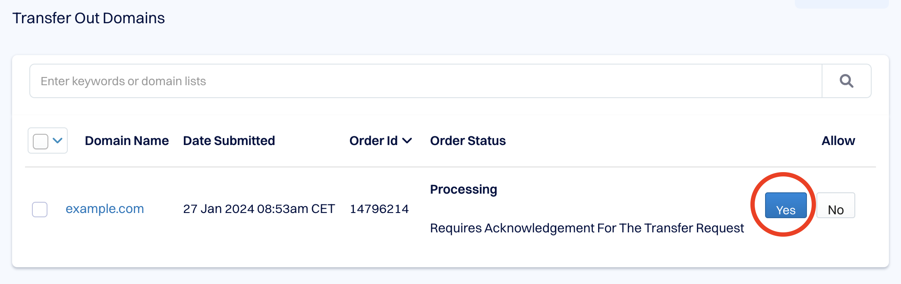
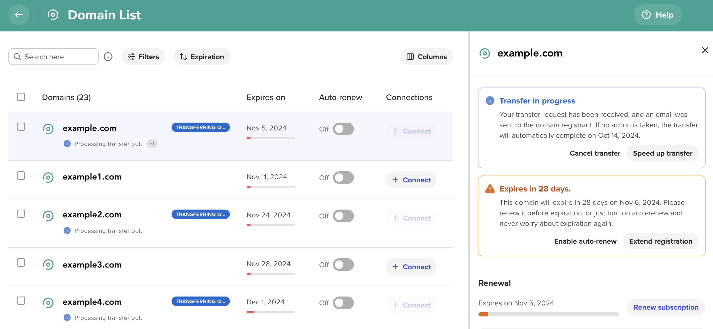

# Expedited Transfer Out Registrars

A list of domain name registrars that offer the ability to expedite outbound domain transfers.

Typically, a domain transfer between registrars can take 5-7 days to complete. However, some registrars allow you to expedite the transfer, reducing the process to just a few hours by following certain steps. Below is a list of such registrars, along with a description of the steps required to expedite the transfer.

## Table of Contents

- [Cosmotown](#cosmotown)
- [Dynadot](#dynadot)
- [Name.com](#namecom)
- [NameSilo](#namesilo)
- [Porkbun](#porkbun)
- [Sav](#sav)
- [Spaceship](#spaceship)

## Cosmotown

After you've initiated a domain transfer with the receiving registrar, Cosmotown will send you an email with the subject "Action required: Your domain is transferring out of Cosmotown domain.name." The email will include two buttons: "Approve" and "Reject." 

To immediately approve the transfer, click the "Approve" button. To reject the transfer, click the "Reject" button.

## Dynadot

After you've initiated a domain transfer with the receiving registrar, Dynadot will send you an email with the subject "Transfer Away (order ########)." The email will contain the following text:

```
Hey [username],

Today, we received notification that you’d like to transfer example.com to another domain name registrar: [receiving registrar].

Please use the following button to AUTHORIZE or CANCEL the domain transfer within five (5) days of this message:

https://www.dynadot.com/account/domain/transfer/out.html

NOTE: If you don’t respond, the transfer will automatically be approved after five (5) days, and the domain will go to the new registrar.

If you didn’t request the transfer away of this domain, please let us know at info at dynadot dot com.

All the best,  
Dynadot
```

To approve the transfer, simply follow the link in the email: [https://www.dynadot.com/account/domain/transfer/out.html](https://www.dynadot.com/account/domain/transfer/out.html). This will take you to the "Transfer Out Domains" page.



The "Order Status" for the domain will display as "Processing. Requires Acknowledgement For The Transfer Request." In the "Allow" column for the domain, you'll see two options: Yes and No. Click the "Yes" button. Afterward, you should briefly see the message "Transfer has been accepted," confirming that your transfer approval was successful.

## Name.com

Name.com explains how to expedite an outbound domain transfer in the article [Approve or expedite a domain transfer
](https://www.name.com/support/articles/206103837-approve-or-expedite-a-domain-transfer).

## NameSilo

NameSile describes how to expedite an outbound domain name transfer in their article [How to transfer away from NameSilo
](https://www.namesilo.com/Support/How-to-transfer-away-from-NameSilo).

## Porkbun

Porkbun supports expedited outbound domain transfers. Read the details in their article [How to approve an outbound transfer from Porkbun
](https://kb.porkbun.com/article/139-how-to-approve-an-outbound-transfer-from-porkbun).

## Sav

Once you receive an email from Sav with the subject "Domain Transfer Out Started," navigate to the domain details of the relevant domain in your Sav "My Domains" panel. Click the "Approve" link next to the "Pending Transfer" status of the domain. 

Sav has a support article titled [Transferring a Domain Away from Sav](https://help.sav.com/hc/en-us/articles/11932938198171-Transferring-a-Domain-Away-from-Sav), but it does not mention the option to expedite a domain transfer.

## Spaceship

To transfer a domain away from Spaceship, you need to follow these steps: first, unlock the domain, retrieve its authorization code from Spaceship, and then initiate the transfer with the receiving registrar. It may take anywhere from a few minutes to a few hours to receive an email from Spaceship with the subject "Confirmation of Registrar Transfer Request." You will receive one such email for each domain being transferred out.

Once you've received the email, log into your Spaceship account and navigate to the "Domain List" section. Domains pending transfer will be marked with a "Transferring out" tag. Click on the domain, and in the "Transfer in Progress" window, you will see two options: "Cancel Transfer" and "Speed Up Transfer." Choose the "Speed Up Transfer" option. The domain will then be immediately removed from your domain list at Spaceship.

